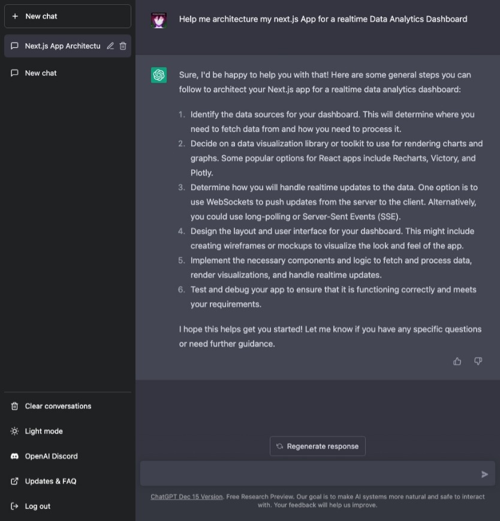

# Using ChatGPT to fully plan a Realtime Dashboard App (Architecture, Stack, Implementation and Deployment as a Technical Founder)

<p align="center">

</p>

<p align="center">
Your friends/colleagues once you start leveraging ChatGPT for work
</p>

> This article continues my series on working with ChatGPT, and just seeing for myself how far I can push it, and what a *2.0* could do better. This time, I'm going to look at it from the perspective of a Product Manager.

In my last blog, which you can read [here](https://medium.com/@sushrit.pk21/chatgpt-copilot-and-the-future-of-coding-interviews-a-technical-founders-perspective-8628c7102a9b), I looked into ChatGPT and GitHub Copilot, and how the two of them can change the way we conduct interviews and a developer's daily workflow/productivity. So this time, let's use it to actually plan a fullstack application, and see how it performs to varying needs from me, the Product Manager who is looking to build a Realtime Analytics Dashboard.

## Defining the Problem

Now let's just assume that we want to build is a simple dashboard that just updates in real time and shows a couple of graphs based on the incoming data. To keep things consistent across numerous runs, I'm specifying that I want to work with Next.JS and TypeScript/JavaScript (let's just say that's the preferred stack at my organization). With these criteria in mind, I drafted my first prompt, asking it to help me acrhitecture this.

> My Prompt: Help me architecture my next.js App for a realtime Data Analvtics Dashboard

> ChatGPT: Sure, I'd be happy to help you with that! Here are some general steps you can follow to architect your Next.js app for a realtime data analytics dashboard:
> 1. Identify the data sources for your dashboard. This will determine where you need to fetch data from and how you need to process it.
> 2. Decide on a data visualization library or toolkit to use for rendering charts and graphs. Some popular options for React apps include Recharts, Victory, and Plotly.
> 3. Determine how you will handle realtime updates to the data. One option is to use WebSockets to push updates from the server to the client. Alternatively, you could use long-polling or Server-Sent Events (SSE).
> 4. Design the lavout and user interface for your dashboard. This might include creating wireframes or mockups to visualize the look and feel of the app.
> 5. Implement the necessary components and logic to fetch and process data, render visualizations, and handle realtime updates.
> 6. Test and debug your app to ensure that it is functioning correctly and meets your requirements.
> I hope this helps get you started! Let me know if you have any specific questions or need further guidance.

<p align="center">

</p>

<p align="center">
Screenshot of the Conversation
</p>

### Thoughts

This was a well structured response, if you followed the steps you could come up with a solid architecture for the application. You could take this a step further and ask it to help you at each step as well, but that is straightforward. I have other plans for the next questions.

## Architecting the Next App (Folders)

This time, my goal was clear, just have ChatGPT give me a folder structure that could work best with my current requirements. I also made sure to not specify my stack or problem statement, this time to test how well it retains and prioritizes various aspects of the context it has been given.

> My Prompt: Give me a good folder structure template for this use case.

> ChatGPT: Here is a suggested folder structure for a Next.js app that presents a realtime data analytics dashboard:

```
my-app/
  pages/
    index.js    # the dashboard page
  components/   # reusable UI components
    chart.js    # a chart component
    layout.js   # the app layout
  lib/          # utility functions
    data.js     # functions for fetching and processing data
  public/       # static assets
  styles/       # global styles
  .env          # environment variables
  next.config.js
  package.json
```

> This is just a starting point, and you can adjust the structure as needed based on the specific requirements of your app.

> For example, you might want to create separate folders for different types of charts, or for different pages in your app. You might also want to add a 'server' folder if you are using a custom server for your app.

> I hope this helps give you an idea of how to organize your files! Let me know if you have any other questions.

<p align="center">

</p>

<p align="center">
Screenshot of the Conversation
</p>

### Thoughts

This was another great response, that was presented well (the code block was a nice inclusion). Overall the folder structure is basically what you'd start with as ChatGPT also admits, just rename everything to `.ts` and `.tsx` and you are good to go. To Next.js 13 users, you may wonder why it did not go with the new `app` approach, well that is simply because Next.13 wasn't out when the training data for ChatGPT was curated, so I did not expect to see that here.

## Graphs and Visualizations

Well picking a library for this is always a tough choice, and does require some planning, some libraries offer good out-of-the-box look and feel and a rich set of graphs, but they may not be as easy to work with in certain edge cases (responsivity has been a plague). So let's see how ChatGPT handles this.

> My Prompt: Can you compare the top graphing/visualisation libraries that work with Next.JS and offer TypeScript Support, which fit my requirements?

> ChatGPT: Sure, here are some popular graphing and visualization libraries that work with Next.js and offer TypeScript support:
> 1. Recharts: This is a composable charting library built on top of D3. It offers a wide range of chart types and is highly customizable. Recharts has
TypeScript definitions available, so you can use it with TypeScript in your Next.js app
> 2. Victory: This is a library of modular charting components for React. It offers a wide range of chart types and is designed to be easy to use and customize.
Victory has built-in TypeScript support, so you can use it with TypeScript in your Next.js app.
> 3. Plotly: This is a library for creating interactive charts and graphs. It offers a wide range of chart types and is highly customizable. Plotly has TypeScript definitions available, so you can use it with TypeScript in your Next.js app.
> 4. Chart.js: This is a library for creating simple, clean, and engaging charts. It offers a wide range of chart types and is highly customizable. Chart.js has TypeScript definitions available, so you can use it with TypeScript in your Next.js app.

> I hope this helps! Let me know if you have any other questions or need further guidance.

<p align="center">

</p>

<p align="center">
Screenshot of the Conversation
</p>

### Thoughts

This response was not as informative as I'd like it to be. Sure it gave me the list of libraries that even I personally believe to be the best, and I usually do pick between them. But it did not offer any solid comparisons. Something like how Victory has React Native support and good responsiveness would've been a good inclusion. Sure you could ask it about each to get more context, but this response was on the weaker side in my opinion when compared to the rest.

## WebSockets or Socket.io

When I first asked for an architecture, step 3 mentioned using WebSockets to handle the realtime updates, and I was curious to know if ChatGPT could help me decide between WebSockets and Socket.io. Since this is a common confusion for most people getting into WebSockets in the JS ecosystem.

> My Prompt: Should I use socket.io for this, or WebSockets?

> ChatGPT: Socket.io and WebSockets are both libraries that you can use to establish realtime communication between a client and a server. Here are some differences between the two:

> - Socket.io is a JavaScript library that provides a wrapper around WebSockets, and it offers a number of additional features such as automatic fallback to other real-time communication protocols (e.g. long-polling) in cases where WebSockets are not supported. This makes Socket.io more user-friendly, but it also means that it has a larger codebase and may have a slightly higher overhead than WebSockets.
> - WebSockets is a protocol that allows a client and a server to establish a bidirectional communication channel over a single TCP connection.
WebSockets is more lightweight than Socket.io, but it does not offer the same level of abstractions and may require more manual work to set up.

> Overall, the choice between Socket.io and WebSockets will depend on your specific requirements and the trade-offs that you are willing to make. If you need a more fully-featured and user-friendly solution, Socket.io might be a good choice. If you want a more lightweight and low-level solution, WebSockets might be a better fit.

> I hope this helps! Let me know if you have any other questions or need further guidance.

<p align="center">

</p>

<p align="center">
Screenshot of the Conversation
</p>

### Thoughts

Another great response, it told me exactly what I needed to know if I was completely new to Sockets in JS. It also gave me a good idea of the trade-offs between the two, and how to decide between them. I'd say this is one of the best responses I've seen from ChatGPT so far in this exchange.

## The Backend

Now that we have the frontend architecture and the libraries we need, we need to decide on the backend. I was curious how ChatGPT would handle this, to keep things within the TS ecosystem I did mention it explicitly, to avoid a response that focused on something that offered greater Sockets Performance, that was sure to be Go or Elixr.

> My Prompt: Help me decide a TypeScript based stack for my backend implementation for this project that works well with Next.JS

> ChatGPT: Here is a suggested stack for a backend implementation for a Next.js app using
TypeScript:
> 1. Node.js: This is a JavaScript runtime that you can use to build your backend application. You can use TypeScript with Node.js by transpiling your TypeScript code to JavaScript using a tool like tsc (the TypeScript compiler).
> 2. Express: This is a popular web framework for Node.js that you can use to build your backend API. You can use TypeScript with Express by defining your routes and middleware as TypeScript classes or functions.
> 3. MongoDB: This is a NoSQL database that you can use to store your application's data. You can use TypeScript with MongoDB by installing the
'@types/mongodb package, which provides type definitions for the MongoDB driver.
> 4. AWS Lambda: This is a serverless compute service that you can use to run your backend code. You can use TypeScript with Lambda by transpiling your code to JavaScript and packaging it as a ZIP file.

> I hope this helps! Let me know if you have any other questions or need further guidance.

<p align="center">

</p>

<p align="center">
Screenshot of the Conversation
</p>

### Thoughts

This response, while makes sense (it is also not entirely correct) when you break it down based on your experience, it offers less information the way ChatGPT decided to present it. Yes MongoDB in this case with its faster transaction speed would be the suitable DB over anything SQL.

**Express** is again the way to go for this, but I would've liked to see a mention of Fastify or NestJS, which are also great options (probably a mention with some comparisons could be extracted with additional prompts).

**The Mistake**: AWS Lambda is a good cost-effective/performant option to build your serverless applications and yes you can turn **Express** into a serverless application with something like `serverless-express`. But this is where either due to context sensitivity or just the lack of understanding of the underlying concepts (this is a Large Language Model that predicts the next token based on your inputs, the sheer volume of data it has seen allows it to make near correct responses, it doesn't in anyway understand anything it is trained on and that was never claimed either, just clarifying this for anyone who has this notion) hurts the response.

AWS Lambda cannot be used for Socket Applications, because by its nature its meant for a quick start and stop, where I call an endpoint and a Lambda function is triggered, that executes my Business Logic and then exits. Sockets need persistent instances, and the socket addresses for the connections are persisted in memory, this is how you can send messages to someone who is part of the same `room` in socket.io. So this omission is a good example of how LLMs can fail too (granted this is not an obvious mistake if you are new to all this).

I should also clarify that maybe it intended to have me implement the non-socket aspects in Lamba (which is the way to do it), but it really did not make that clear, and sockets are a huge part of this application, so I guess its 50-50 on both of us.

## Deploying to AWS

While keeping in mind the omission from the previous section I did want to give ChatGPT a fair shot at this, so I explicitly asked it to give me a good setup to deploy to AWS. I also asked it to make it as close to Vercel (for the Next.js app since Vercel does a great job with architecting their services and that config is not always easy to reproduce. I wrote a detailed blog about some configs, and when you should switch away from Vercel to make the most economic sense that you can read [here](https://medium.com/@sushrit.pk21/how-when-and-why-you-should-switch-from-vercel-to-a-different-hosting-provider-especially-for-8ba25e439788)).

Also asked it to give me a cost breakdown, since I was curious to see how it would handle that.

> My Prompt: Help me host this Next App using AWS with suggested services and an estimated cost for them together. Make it as close to Vercel as possible.

> ChatGPT: To host your Next.js app on AWS, you can use a combination of the following services:
> Amazon S3: This is an object storage service that you can use to store your app's static assets, such as images and JavaScript files.
> - Amazon CloudFront: This is a content delivery network (CDN) that can accelerate the delivery of your app's static assets to users.
> - AWS Lambda: This is a serverless compute service that you can use to run your app's server-side code.
> - Amazon API Gateway: This is a service that you can use to create an API for your app.
> - Amazon Route 53: This is a domain name system (DNS) service that you can use to register a domain name and set up custom DNS records for your app.

> Here is an estimated cost for using these services to host a Next.js app on AWS:
> - S3: Prices start at $0.023 per GB per month for storing objects in the Standard storage class.
> - CloudFront: Prices start at $0.085 per GB for the first 10 TB of data transferred per month.
> - Lambda: Prices start at $0.00001667 per GB-second.
> - API Gateway: Prices start at $3.50 per million API calls.
> - Route 53: Prices start at $0.50 per month for a domain name.

> Keep in mind that these are just rough estimates, and your actual costs may vary depending on the specific usage patterns of your app.

> I hope this helps give you an idea of the costs involved in hosting a Next.js app on AWS! Let me know if you have any other questions.

<p align="center">

</p>

<p align="center">
Screenshot of the Conversation
</p>

### Thoughts

This was a detailed response, and the pricing was not something I expected it to include (since that data must've fluctuated a lot in its training data), they also vary region-wise and get adjusted from time to time, but a good touch to help you make a ballpark estimate.

## Estimating costs based on usage

Now in the last part of its response, it did say that the costs may vary depending on usage patterns, so I was curious if I could get it to do some math for me. I added a few parameters around usage to my prompt.

> My Prompt: Can you estimate a monthly cost with the above AWS deployment, if I had ten thousand users who made at least 50 operations per visit. With an average DAU count of 1500 

> ChatGPT: To estimate the monthly cost of hosting a Next.js app on AWS with 10,000 users who make at least 50 operations per visit, and an average DAU count of 1,500, we need to consider the following factors:
> - Data transfer: This will depend on the size of your app's static assets, as well as the amount of data that your users transfer when they interact with your app. Assuming that each operation results in the transfer of 1KB of data, and that each user performs 50 operations per visit, the total data transfer for 1,500 DAU would be 75MB per day, or 2.25GB per month. At the current CloudFront pricing of $0.085 per GB, this would cost approximately $0.19 per month.
> - Lambda usage: This will depend on the amount of computation required to process each operation, as well as the number of operations that are performed per day. Assuming that each operation requires 100ms of compute time, and that there are 1,500 DAU performing 50 operations per day, the total compute time for your app would be 750,000ms per day, or 22.5 million seconds per month. At the current Lambda pricing of $0.00001667 per GB-second, this would cost approximately $3.75 per month.
> - API Gateway usage: This will depend on the number of operations that are performed per day. Assuming that there are 1,500 DAU performing 50
operations per day, the total number of API calls for your app would be 75,000 per day, or 2.25 million per month. At the current API Gateway pricing of $3.50 per million API calls, this would cost approximately $7.88 per month.
> - S3 storage: This will depend on the size of your app's static assets. Assuming that your app's static assets are 500MB in total, the total S3 storage cost for your app would be approximately $0.011 per month at the current $3 pricing of $0.023 per GB per month.
> - Route 53: The cost for a domain name registered through Route 53 is currently $0.50 per month.

> Altogether, the estimated monthly cost for hosting a Next.js app on AWS with the above usage patterns would be approximately $12.23. This is just a rough estimate, and your actual costs may vary depending on the specific details of your app and its usage.

> I hope this helps! Let me know if you have any other questions.

<p align="center">

</p>

<p align="center">
Screenshot of the Conversation
</p>

### Thoughts

Now this is the perfect response, it was detailed, and it gave me a good idea of what I could expect. This is a place where it shines well and that makes it a value add-on. This actually gave me ideas for my next questions. Lets find out together.

## Can it generate Documentation?

Now I'm not looking for in-line documentation, Copilot does this more seamlessly within you editor anyway. Could ChatGPT actually generate a proper Project Requirements Document (PRD) for me? I was curious to find out.

> My Prompt: Can you draft a Product Specifications Document with my requirements from above?

I'll just include the response here, since it was a long one.

<p align="center">

</p>

<p align="center">
Screenshot of the Conversation
</p>

### Thoughts

This was unexpectedly good, I did not expect that level of formatting and such detail, it actually laid out a sensible timeline for me to follow. I was impressed. You could legitimately take this document and build off of it if you've no PMO dictating standards.

## How about Stories?

Now, with my mind blown from how it handled documentation, I just had to ask it if it could write stories for me based on the timeline it detailed (and I was curious to see if it would follow the same timeline it suggested and work around it).

> My Prompt: Can you create sprints with stories based on the project timeline you have specified?

Again the response was long, so I'll just include the screenshot here.

<p align="center">

</p>

<p align="center">
Screenshot of the Conversation
</p>

### Thoughts

Once again, I was impressed, these are well written stories from my POV as a PM/Developer in this scenario, yes given more context about the Team's makeup it could probably fit them into this and create stories (and that is just amazing to think about).

## A few more Questions that were interesting

I asked it a lot of questions as part of my preparation for this article, and I'll just include a few of the more interesting ones here.

<p align="center">

</p>

<p align="center">

</p>

There's so much ChatGPT can bring to the table given the right context, and I'm excited to see what it can do in the future with a V2, that has more context sensitivity tuning, like say I give weights to each keyword in my query to help it focus on what's important to me.

## Conclusion

I spent the last month using ChatGPT, talking to people who have been using it, and worked on refining my prompts and seeing firsthand how much of a difference it makes. I took a second to ask it a funny question that you might find interesting or funny or both.

<p align="center">

</p>

And on that note of uncertainty, I offer you a very certain ending to this blog, but before that let me pitch my Startup to you.

If you are looking to leverage ChatGPT and Copilot, you are surely leaning towards building projects with them, and if you are one such person or a group, then check out [skillShack(⚡️);](https://skillshack.dev/) — A platform for you to do exactly those things:

- Network
- Share your projects (get feedback on your code or your execution from our community)
- Document your progress
- Connect with other developers
- Collaborate, find opportunities, and more!

You can have all your activities compiled into one amazing Resume that you can take anywhere, and certificates that commend you for each project you have worked on!

<p align="center">

</p>

Thanks for sticking till the end, have a productive day! Consider following me if you want to join me on my journey ([you can read about my journey here](https://medium.com/@sushrit.pk21/how-i-built-my-startup-as-a-solo-developer-8561bf7eebde)) as I build and scale this company to reach more developers like you!
