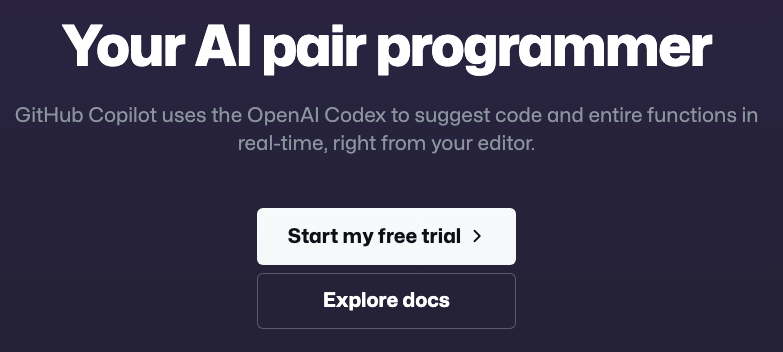
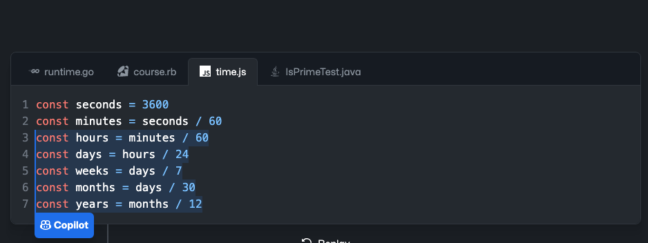
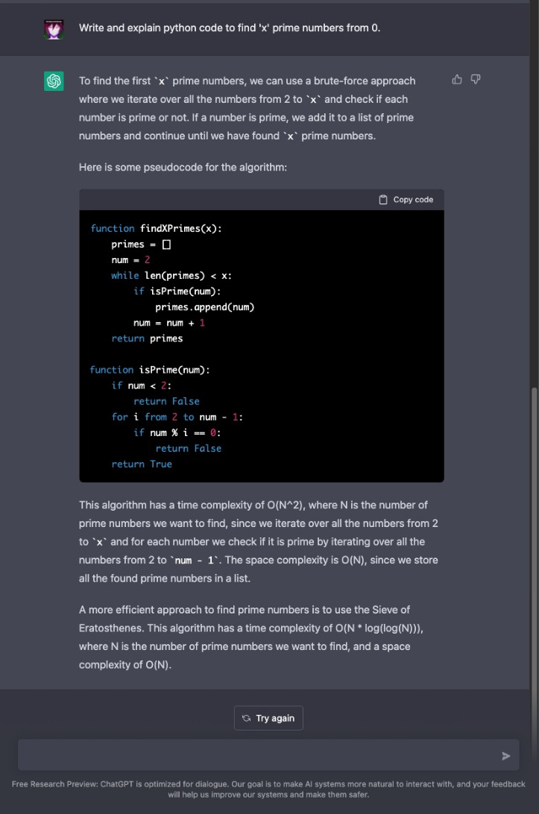
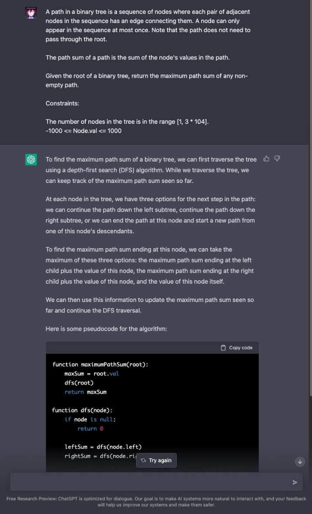
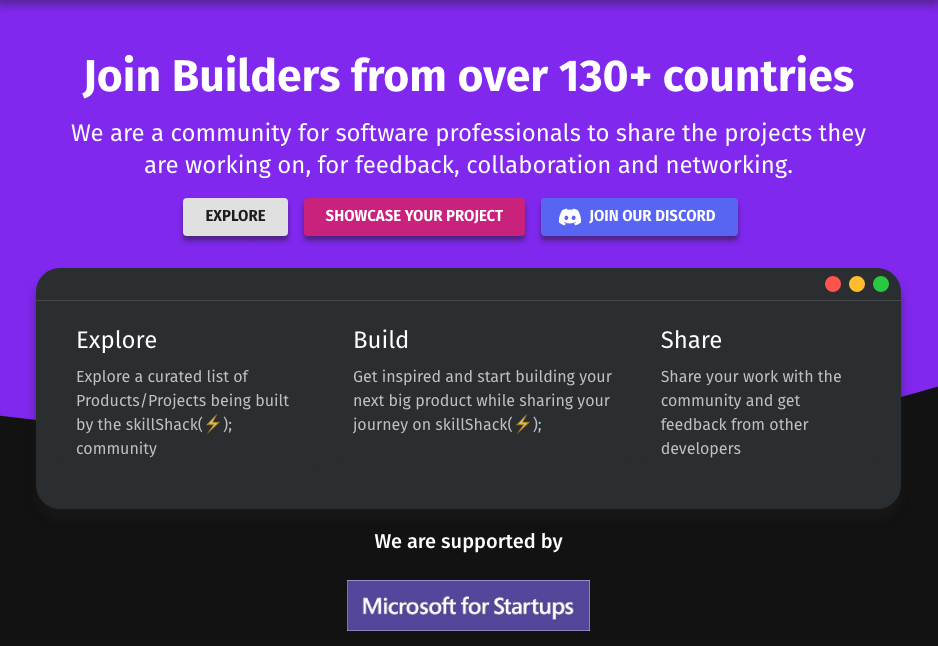

# ChatGPT, Copilot and the future of Coding Interviews - A Technical Founder's Perspective

> This article will talk about how OpenAI's ChatGPT and GitHub Copilot are going to change the way we interview, and why it's a good thing.

It's been less than a fortnight since ChatGPT was released into the wild, and GitHub Copilot has been out for a full year (released Oct 29, 2021) and more now. This sounds like a good time to talk about how Copilot, which was the original "this AI will take our jobs away" thing has aged, and how the new challenger (I would call it a complementary tool honestly) fits in.

## What is Copilot? And my experience with it.

Props to GitHub honestly, their marketing team knew exactly what to call Copilot. Take a look at the first line on the product page.

 They call it "Your AI pair programmer".

And that's exactly what it has always been. I got access to the early access a month after it came out, and I've been daily driving Copilot since then, and also signed up for the 1 Year plan the second it went live. Talking about me, I've been building and scaling my startup [skillShack(⚡);](https://skillshack.dev/) for 2 years now, and during this time I have used Copilot to generate tonnes of boilerplate code and smart blocks. Writing type annotations in TypeScript, given enough context Copilot will prompt them for you. You just have to write the right amount of code and then it will prompt code that will save time. 

Usually, code that I found the most use of was Type Annotations on either side of an API when I was mixing languages (some of my API was built on FastAPI to serve my Tensorflow mode for analytics) while the remaining stack was PERN (Postgres Express React/Next NodeJS), this made most of my development hassle-free because I wasn't switching panes or overwhelming my memory by trying to keep all those properties in my mind. 

It has also been a great way to write unit tests, most of the time I am just hitting <kbd>Tab</kbd> to generate unit tests, and review them at the end, this is an underrated use-case for Copilot in my opinion.

  Prompts like these are exactly what I'm referring to, with the right context, it can save you a lot of time.

And in certain places where I was feeling particularly lazy, I would just spend some time writing a detailed comment about what I wanted like a roll-over carousel in one case, and it gave me the logic to ensure that you come back to the start after the last page, and the CSS Transforms to go with it, depending on the direction in which you were scrolling, that is easy to do normally but would've required a few tweaks to get it working exactly how I wanted it. Most of the code generated needs inspection, but that is less of a mental overhead if you know what you're working with, this is where exposure to what you're working with helps since the syntax or quirks of a library/framework wouldn't confuse you. It would be more of: "Oh I see why it decided to use Memoization here, why didn't I think of that?" and not "What is happening here?". You tend to mess up and use the wrong strategy at times when working, and Copilot like the "pair programmer" that it is, will help you with this.

It's like switching from a plain text editor to write your code to an IDE with syntax highlighting and error highlighting, you get more context and hints that help you focus on what you are doing rather than scan the lines manually for issues and typos. sure a good programmer should be able to look at the syntax and figure out what's wrong or fix errors based on warnings some may argue, but this is literally a QoL improvement.

The reception has been mixed, some find the prompts to be a hindrance as they work (I usually disable and enable prompts when needed to avoid that clutter), and others have gotten good with the "prompts" (which you will see are just as important with ChatGPT). Overall, it's literally a tool. I use Neovim, while others use VSCode, I'm productive on Neovim because I taught myself its quirks and learned to make use of them to gain the edge, while others are used to the workflow within VSCode and can probably in some cases work as fast as I could. It's all about how you utilize the tool.

## What is ChatGPT? And my experience with it.

ChatGPT came out on Nov 30, 2022, and immediately made headlines just like Copilot did last year about how it will probably take your job. Yes, ChatGPT is a significant upgrade over Copilot and it does this while also being able to answer non-CS things like the nuances of why Light behaves like a particle and wave at the same time.

Kudos to the engineers and teams behind both ChatGPT and Copilot, the progress over a year is nothing short of extraordinary. When I started with NLP and NLU in 2014, I tried various early-stage language models and knowledge-base building techniques when I was working on my own in-house "Jarvis" [you can see it in action here](https://youtu.be/Ouc1A_DY88w), and as I scaled it and looked into things like BERT/ALBERTA and GPT-1, I could see the limitations and trade-offs at that time and expected it to only get to this level by 2025 at best, so personally, this is like a super exciting thing for me!

That aside, ChatGPT at least in the CS context can be used to generate code for you. With Copilot you would integrate it into your IDE and it would scan your code and give itself context for the prompts. So the comments you'd write before a function declaration and the code above it will help it give you the best prompt. With ChatGPT, it is more conversational as the name implies. You have to give it a smart prompt to get it to write code for you along with explanations(Copilot generates good documentation in this case, while you could use ChatGPT to get a better ELI5 explanation of the code it gave you).

Here's an example where assume that you're new to python and are trying to get some code to generate prime numbers and are stuck on the logic. You can ask ChatGPT to generate code for you and it will give you a working solution with explanations.

Now StackOverflow toxicity memes aside, this is a good way to get some useful explanations when the material you are referring to isn't as clear (not all material is perfect with every topic). I would still recommend going to StackOverflow or Reddit for help, you meet some cool people once the pitchfork wielders leave and that's always good.

In the next section, I'll talk about how this will change the way we interview.

## How will this change the way we interview?

Coding interview prep has always been, Grind LeetCode, and hope for the best. While I'm not against Competitive Programming and LeetCode/HackerRank way of getting better at code, a lot of people end up working on these, and never practically building projects beyond the tutorial follow-along builds. This breeds its own flavor of imposter syndrome in my opinion. However, one cannot be blamed in today's market for grinding out LeetCode to bag a big FAANG (MANGA now?) job and starting their career with it. However, with the advent of Copilot and ChatGPT, the interview scene has to take a hard look at how interviews should actually change to see how prospective candidates leverage these tools to produce higher-quality code, in less time without the introduction of tech debt.

For fun, I threw a `Hard` LeetCode problem at ChatGPT and just copy pasted the problem statement (made no other tweaks to the prompt) here's what I got:

If I tweaked the prompt a bit more I could've gotten more than the pseudo-code, but that is actually super handy, for most of us arriving at the right pseudo-code is the hardest part of the problem, for someone trying to use this to cheat would have a hard time to come up with code, because they probably lack the experience with the language to properly implement the pseudo-code (and would get worse with a more sophisticated language like C++ over Python which is straight forward from pseudo-code).

The takeaway for people devising interviews now would be to switch to more practical problem solving that relates to the scope of work at the job, more take-home problems, whiteboarding, and preferably talking about personal projects and breaking them down to see the quality of developer before you. Because if you understand how everything fits together, you can leverage these tools to build a robust system with greater speed. It's a bit of a role shift where you are now a team lead, with Copilot and ChatGPT becoming your team members whom you give pointers and work with to deliver your work. You will have to plan things in greater detail, you now have the time and energy to adopt TDD (a huge QoL boost for most Devs in small teams in startups) and many more sustainable development practices.

## Closing thoughts

At some point, getting good at writing smart prompts will become a must-have skill just like how googling is a must-have skill. In the end, I still like to think that, 90% of the code we write (CRUD Ops, Landing pages, Forms) could be generated with these, but the creative and problem-solving parts of writing code, UX, and Optimization aren't going away anytime soon. At this point, I wouldn't be surprised if you could use Stable Diffusion to generate Mockups.

Every field has disruption when a greater degree of automation is introduced, and sure jobs are disrupted and that is always unfun when it happens to you, but in Tech, we can learn quickly, build quickly and upskill quickly.

In the meantime, you can build projects and prepare yourself for this upcoming shift in how interviews will take place.

And if you are one such person or a group, then check out skillShack(⚡️); — A platform for you to do exactly those things:

- Network
- Share your projects (get feedback on your code or your execution from our community)
- Document your progress
- Connect with other developers
- Collaborate, find opportunities, and more!

You can have all your activities compiled into one amazing Resume that you can take anywhere, and certificates that commend you for each project you have worked on!

Thanks for sticking till the end, have a productive day! Consider following me if you want to join me on my journey ([you can read about my journey here](https://medium.com/@sushrit.pk21/how-i-built-my-startup-as-a-solo-developer-8561bf7eebde)) as I build and scale this company to reach more developers like you!
